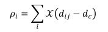
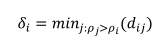
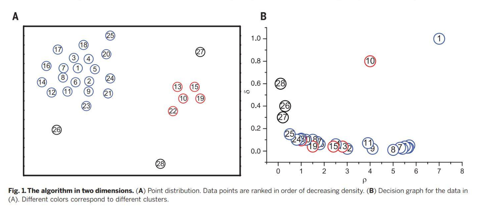
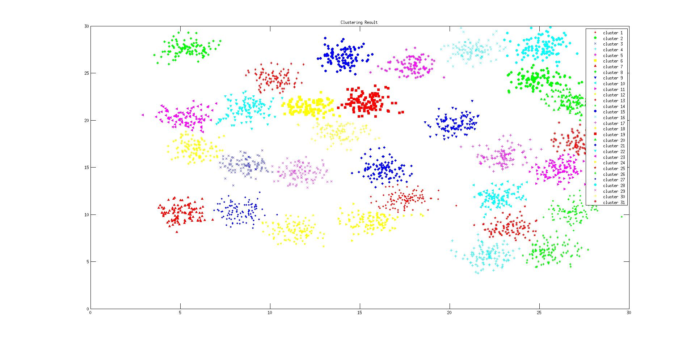
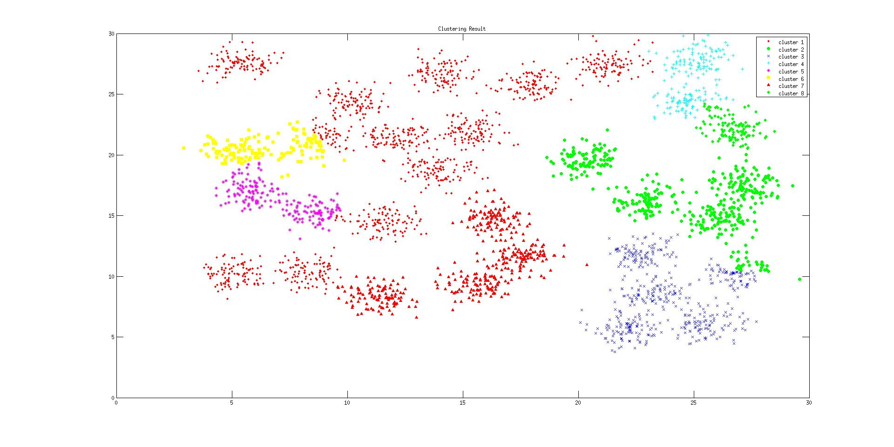
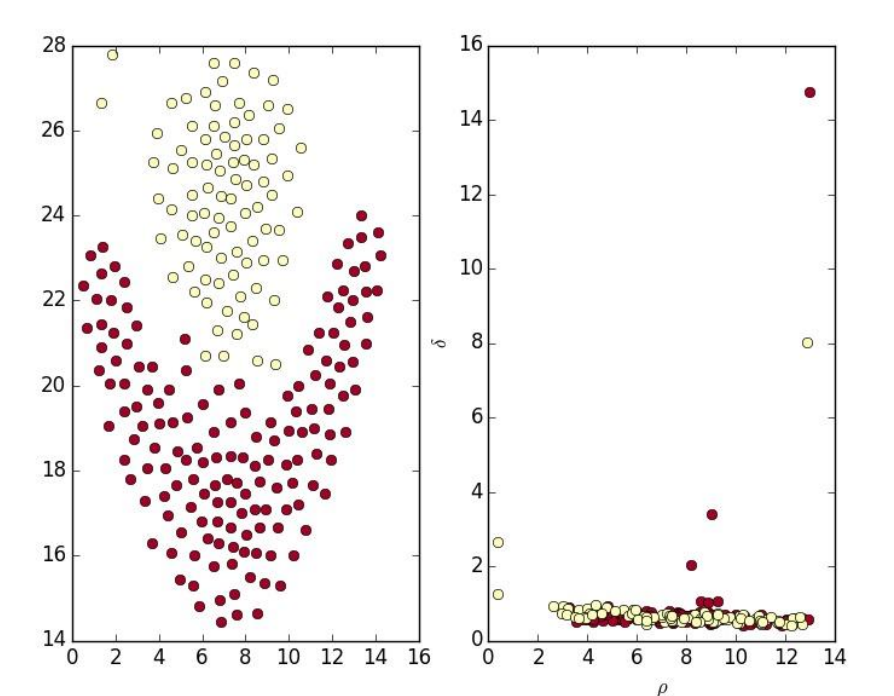
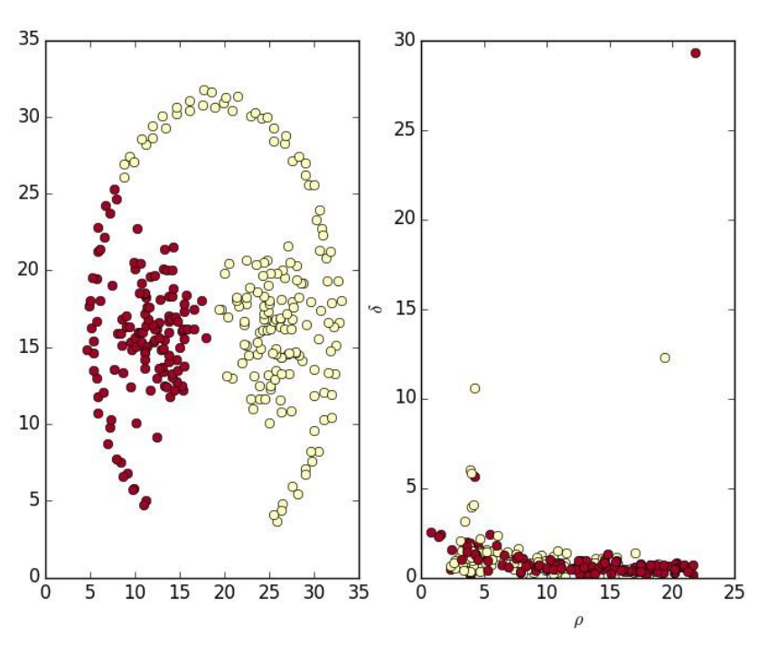
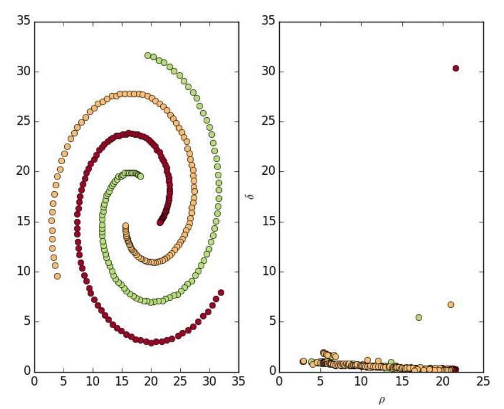
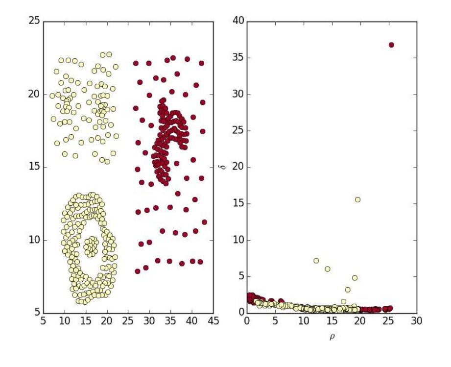
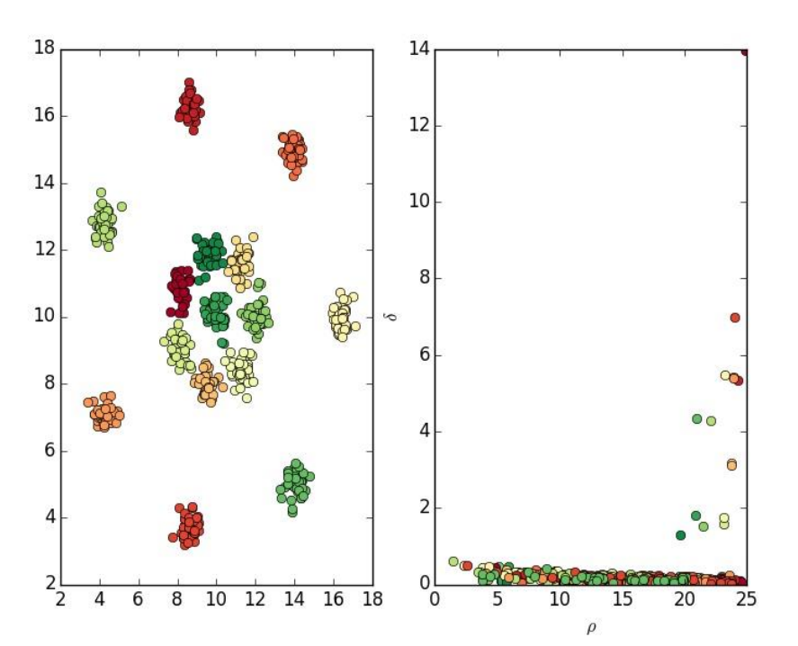

Clustering by fast search and find of density peaks
========
Clustering by fast search and find of density peaks 是今年 6 月发表在Science上的一篇关于聚类算法的论文， 作者为Alex Rodriguez
和 Alessandro Laio。 自论文发表以来， 文中所提算法以其简洁性、优美性和有效性获得了广泛关注。

在本次实验中，我们通过对论文的学习和研究，重现了论文中的算法和聚类实验，对该算法的效果进行了分析，并对这项工作进行了总结和展望。

### 算法思想

在本篇论文中，作者提出了一个聚类算法的基本思想：类簇中心总是比它们的邻居点有更高的密度，并且和更高密度的点之间有相对较大的距离。基于此，我们可以对类簇中心进行选择，然后将外围的点归类到某一类中。
根据算法的基本思想，我们需要计算两个量，第一个是点i周围的密度，第二个是它和更高密度的点之间的距离。





根据以上两个值，我们可以找到两者都较大的点，作为类簇中心，并对其它的点做分配。

另外作者提到，如果到其他高密度点的距离很大，但是周围密度很小，那么这个点有可能是异常点（如下图中的26、27、28）



可以通过添加一个点周围要有tau%的点才算一个类的条件来避免。

### 数据集介绍

本次使用的数据集如下：

```
Name		PointsNum	Description
Flame		240			火焰型
Pathbased	300			1个圈中间围绕着2簇
Spiral		312			3条螺旋曲线
Compound	399			多簇，每簇的大小不同
R15			600			如名字所示，15簇
D31			3100		如名字所示，31簇
```

### Build & Run

```
make
make run
```

然后使用`tools/plot_res.m`显示结果

### 实验结果

对于31个簇的图，聚类过程中没有告诉有多少个类，结果如下



成功的聚出了31个类。

此处一个点周围要有3%(tau=3%)的点才算一个类，若改为一个点周围要有3%(tau=5%)的点才算一个类



则只能聚出8个类了。

其他的聚类结果如下











### 性能分析

```
Name		PointsNum	time
Flame		240			0.01s
Pathbased	300			0.015s
Spiral		312			0.017s
Compound	399			0.024s
R15			600			0.050s
D31			3100		1.22s
```
